# Dart SDK Bazel Migration: Active Backlog & Coordination Board

This file is generated automatically from `backlog.json`. **Do not edit this file directly.**
To make changes, edit `backlog.json` and run:
`tools/sdks/dart-sdk/bin/dart docs/bazel-migration/generate_backlog_graph.dart`

> 🚨 **AGENT PROTOCOL (Mandatory)**:
> 1. **Scan**: Read this file FIRST on arrival. Check for open `[PENDING]` tasks.
> 2. **Claim**: Claim a task in `backlog.json` by setting status to `IN_PROGRESS` and owner, then run the generator script.
> 3. **Verify**: Run the exact `Verification Command` in the task block.
> 4. **Update**: Once verified green, update status to `COMPLETED` in `backlog.json`, run the script, and update the session log in `STATUS.md`.

---

## 📊 Global State

- **Active Agent**: `[none]`
- **Global Lock**: `[unlocked]`
- **Overall Progress**: 33/40 Tasks (Completed details in [BACKLOG_HISTORY.md](BACKLOG_HISTORY.md))

---

## 🗺️ Dependency Graph

```mermaid
graph TD
    classDef completed fill:#d4edda,stroke:#28a745,stroke-width:2px,color:#155724;
    classDef inProgress fill:#fff3cd,stroke:#ffc107,stroke-width:2px,color:#856404;
    classDef pending fill:#f8f9fa,stroke:#6c757d,stroke-width:1px,stroke-dasharray: 5 5,color:#6c757d;
    classDef blocked fill:#f8d7da,stroke:#dc3545,stroke-width:1px,stroke-dasharray: 5 5,color:#721c24;
    TASK_001["TASK_001:<br>Dynamic Package Dependency Mapping"]:::completed
    TASK_002["TASK_002:<br>Pre-Computed Package Import Mapping {Fine-Grained Opt-in}"]:::completed
    TASK_003["TASK_003:<br>Windows MSVC Toolchain Port"]:::pending
    TASK_004["TASK_004:<br>Android & Fuchsia Target Platform Registration"]:::blocked
    TASK_005["TASK_005:<br>Dynamic Browser Testing Downloads"]:::completed
    TASK_006["TASK_006:<br>RBE {Remote Build Execution} Verification"]:::pending
    TASK_007["TASK_007:<br>Sanitizer Suite Verification"]:::completed
    TASK_008["TASK_008:<br>Minor SDK Assembly Stubs Resolution"]:::completed
    TASK_009["TASK_009:<br>Relocate and Migrate Worktree Symlinker to Dart"]:::completed
    TASK_010["TASK_010:<br>Non-Flattened Direct Import Mapping for Test Caching"]:::completed
    TASK_011["TASK_011:<br>Repo-Local Upstream SDK Merge Flow Skill"]:::completed
    TASK_012["TASK_012:<br>Coarse-Grained Test Suite Clustering"]:::completed
    TASK_013["TASK_013:<br>Unified Test Repository with Configuration Subtargets"]:::completed
    TASK_014["TASK_014:<br>Python Test Wrapper Unit Testing"]:::completed
    TASK_015["TASK_015:<br>Resolve Bzlmod Lockfile Drift"]:::completed
    TASK_016["TASK_016:<br>Migrate VM Platform and Kernel Service Dill Compilation to Starlark"]:::completed
    TASK_017["TASK_017:<br>Migrate Third-Party Dependencies to Hermetic Bzlmod Overlays"]:::completed
    TASK_018["TASK_018:<br>Compile `dart_engine` Shared Libraries JIT/AOT"]:::completed
    TASK_019["TASK_019:<br>Port `samples/embedder` targets to Bazel"]:::completed
    TASK_020["TASK_020:<br>Migrate `packages.bzl` target generation to a dynamic Bzlmod extension"]:::completed
    TASK_021["TASK_021:<br>Retire `restore.sh` entirely"]:::completed
    TASK_022["TASK_022:<br>VM AOT Test Suite Integration"]:::completed
    TASK_023["TASK_023:<br>Sanitizer Test Configuration Mapping"]:::completed
    TASK_024["TASK_024:<br>Simulator Target Configurations"]:::completed
    TASK_025["TASK_025:<br>Debian Package Build Target"]:::completed
    TASK_026["TASK_026:<br>CI LUCI Recipe Migration"]:::pending
    TASK_027["TASK_027:<br>Investigate Upstreaming Non-Bazel Fixes to Main"]:::completed
    TASK_028["TASK_028:<br>Investigate Google3 Alignment"]:::pending
    TASK_029["TASK_029:<br>Streamline and Optimize Bazel Build Definitions"]:::pending
    TASK_030["TASK_030:<br>Live-Parse DEPS in Bzlmod Extension for Dynamic Dependency Downloads"]:::completed
    TASK_031["TASK_031:<br>Audit and Apply Code Review Learnings across Bazel codebase"]:::completed
    TASK_032["TASK_032:<br>Fix package config generator for workspace packages and dynamic language versions"]:::completed
    TASK_033["TASK_033:<br>Fix SDK packaging VM product mode configuration mismatch"]:::completed
    TASK_034["TASK_034:<br>Add Chrome/Firefox test configurations to Bazel target generator"]:::completed
    TASK_035["TASK_035:<br>Fix Bazel wildcard target evaluation and package loading errors"]:::completed
    TASK_036["TASK_036:<br>Audit and convert remaining cc_library stubs to filegroup or alias"]:::completed
    TASK_037["TASK_037:<br>Cleanup migration documentation and legacy instructions"]:::completed
    TASK_038["TASK_038:<br>Investigate migrating Dart package dependency syncing to Bazel"]:::pending
    TASK_039["TASK_039:<br>Enable standard Bazel lint and formatting checks {Buildifier}"]:::completed
    TASK_040["TASK_040:<br>Implement `bazel run` support for running Dart scripts"]:::completed

    TASK_017 --> TASK_006
    TASK_010 --> TASK_012
    TASK_012 --> TASK_013
    TASK_008 --> TASK_016
    TASK_017 --> TASK_018
    TASK_018 --> TASK_019
    TASK_017 --> TASK_020
    TASK_017 --> TASK_021
    TASK_020 --> TASK_021
    TASK_003 --> TASK_026
    TASK_004 --> TASK_026
    TASK_005 --> TASK_026
    TASK_006 --> TASK_026
    TASK_006 --> TASK_028
    TASK_003 --> TASK_029
    TASK_033 --> TASK_034
```

<!-- START_DEP_GRAPH -->


<!-- END_DEP_GRAPH -->

---

## 📋 Active Backlog

### 🎯 [TASK_003] Windows MSVC Toolchain Port
- **Status**: `[PENDING]`
- **Prerequisites**: None
- **Owner**: `[none]`
- **Commit**: `[none]`
- **Target Files**:
  - `build/toolchain/win/BUILD.bazel`
  - `build/toolchain/win/cc_toolchain_config.bzl`
- **Description**:
  Port MSVC toolchain discovery from `build/vs_toolchain.py` to a dynamic Bazel Starlark repository rule. The rule must auto-detect MSVC installations on the Windows host and generate appropriate `cc_toolchain` definitions dynamically.
- **Verification Command**:
  ```bash
  
  ```
- **Success Criteria**:
  - [ ] MSVC installation path is dynamically detected on Windows hosts.
  - [ ] `//runtime/bin:dartvm` compiles and links cleanly under Windows.
  - [ ] Context & Hints:

---

### 🎯 [TASK_004] Android & Fuchsia Target Platform Registration
- **Status**: `[BLOCKED]`
- **Prerequisites**: None
- **Owner**: `[jetski]`
- **Commit**: `[local]`
- **Target Files**:
  - `build/platforms/BUILD.bazel`
  - `MODULE.bazel`
- **Description**:
  Register full target platforms for Android and Fuchsia. Map Android NDK references via `android_ndk_repository` and Fuchsia toolchains via Google's `rules_fuchsia`.
    > [!WARNING]
    > **BLOCKED**: Cross-compiling for Android requires the Android NDK, which is currently missing on the host environment (no `ANDROID_NDK_HOME` or `third_party/android_tools`). The platforms have been registered in `build/platforms/BUILD.bazel`, but verification is blocked.
- **Verification Command**:
  ```bash
  
  ```
- **Success Criteria**:
  - [ ] Android NDK toolchain resolves and compiles the AOT runtime.
  - [ ] Fuchsia target platforms compile and package cleanly.

---

### 🎯 [TASK_006] RBE (Remote Build Execution) Verification
- **Status**: `[PENDING]`
- **Prerequisites**: `TASK_017`
- **Owner**: `[none]`
- **Commit**: `[none]`
- **Target Files**:
  - `build/toolchain/linux/cc_toolchain_config.bzl`
  - `.bazelrc`
- **Description**:
  Verify remote execution (RBE) against Google's `flutter-rbe-prod` instance in CI. Ensure toolchain configurations correctly serialize and do not leak host-absolute paths to the remote worker.
- **Verification Command**:
  ```bash
  
  ```
- **Success Criteria**:
  - [ ] Entire SDK compiles cleanly on remote RBE workers.
  - [ ] Cache hit rate is high and no local toolchain leaks are observed.

---

### 🎯 [TASK_026] CI LUCI Recipe Migration
- **Status**: `[PENDING]`
- **Prerequisites**: `TASK_003`, `TASK_004`, `TASK_005`, `TASK_006`
- **Owner**: `[none]`
- **Commit**: `[none]`
- **Target Files**:
  - `infra/specs/`
- **Description**:
  Update LUCI build and test recipes to call `tools/build.py --bazel` and `tools/test.py --bazel` respectively, and upload the Bazel-built SDK as a release artifact.
- **Verification Command**:
  ```bash
  
  ```
- **Success Criteria**:
  - [ ] CI builders successfully transition to Bazel for building and testing.
  - [ ] Bazel-built SDK is uploaded to CIPD/GCS storage.

---

### 🎯 [TASK_028] Investigate Google3 Alignment
- **Status**: `[PENDING]`
- **Prerequisites**: `TASK_006`
- **Owner**: `[none]`
- **Commit**: `[none]`
- **Target Files**:
  - `tools/bazel/`
- **Description**:
  Investigate Google3's internal Dart Bazel build and evaluate the feasibility of aligning it with this open-source Bzlmod configuration. Identify blocker issues (monorepo path differences, internal toolchains, RBE configs).
- **Verification Command**:
  ```bash
  
  ```
- **Success Criteria**:
  - [ ] Investigation document detailing differences and migration path for google3.
  - [ ] Prototype alignment run in a CitC workspace (if feasible).

---

### 🎯 [TASK_029] Streamline and Optimize Bazel Build Definitions
- **Status**: `[PENDING]`
- **Prerequisites**: `TASK_003`
- **Owner**: `[none]`
- **Commit**: `[none]`
- **Target Files**:
  - `tools/bazel/dart/defs.bzl`
  - `tools/bazel/rules.bzl`
- **Description**:
  Audit current Bazel build files and custom Starlark rules (`tools/bazel/dart/defs.bzl`, `tools/bazel/rules.bzl`) to simplify flag propagation, reduce macro complexity, and optimize build graph analysis times.
- **Verification Command**:
  ```bash
  
  ```
- **Success Criteria**:
  - [ ] macOS flag filtering moved from macro wrappers to toolchain definitions where possible.
  - [ ] Starlark macro complexity reduced (audited by a senior engineer review).

---

### 🎯 [TASK_038] Investigate migrating Dart package dependency syncing to Bazel
- **Status**: `[PENDING]`
- **Prerequisites**: None
- **Owner**: `[none]`
- **Commit**: `[none]`
- **Target Files**:
  - `tools/bazel/dart/generate_test_targets.dart`
  - `tools/bazel/generate_debug_package_config.py`
- **Description**:
  Evaluate the feasibility and trade-offs of migrating Dart package dependency resolution (currently handled by `gclient sync` and host-side `pubspec` resolution) to run hermetically inside Bazel (e.g., using a custom Bzlmod extension to fetch packages and generate the package config). Address developer workflow impact (ability to edit `third_party/pkg` sources), bootstrap loop implications, and alignment with Google3.
- **Verification Command**:
  ```bash
  
  ```
- **Success Criteria**:
  - [ ] Analysis document detailing feasibility, design options, and trade-offs for hermetic package syncing.

---

