# Dart SDK Bazel Migration: Agent Backlog & Coordination Board

This is the single source of truth for the remaining migration work stream. It is designed to be read, claimed, and updated by autonomous AI agents during long-runtime sessions, and reviewed by human researchers.

> 🚨 **AGENT PROTOCOL (Mandatory)**:
> 1. **Scan**: Read this file FIRST on arrival. Check for open `[PENDING]` tasks.
> 2. **Claim**: Before editing, post a "Soft Claim" by changing the task status to `[IN_PROGRESS]`, adding your Agent ID (e.g., `[jetski-3]`), and committing this file first to lock the task.
> 3. **Verify**: Run the exact `Verification Command` in the task block.
> 4. **Update**: Once verified green, update the task status to `[COMPLETED]`, check the success criteria boxes, append the git commit hash, and update the session log in `STATUS.md`.
> 5. **Handoff**: Release your claim. Never edit a task claimed by another agent.

---

## 📊 Global State

- **Active Agent**: `[none]`
- **Global Lock**: `[unlocked]`
- **Overall Progress**: 28/35 Tasks

---

## 🗺️ Dependency Graph

```mermaid
graph TD
    classDef completed fill:#d4edda,stroke:#28a745,stroke-width:2px,color:#155724;
    classDef inProgress fill:#fff3cd,stroke:#ffc107,stroke-width:2px,color:#856404;
    classDef pending fill:#f8f9fa,stroke:#6c757d,stroke-width:1px,stroke-dasharray: 5 5,color:#6c757d;
    TASK_001["TASK_001:<br>Dynamic Package Dependency Mapping"]:::completed
    TASK_002["TASK_002:<br>Pre-Computed Package Import Mapping {Fine-Grained Opt-in}"]:::completed
    TASK_003["TASK_003:<br>Windows MSVC Toolchain Port"]:::pending
    TASK_004["TASK_004:<br>Android & Fuchsia Target Platform Registration"]:::pending
    TASK_005["TASK_005:<br>Dynamic Browser Testing Downloads"]:::completed
    TASK_006["TASK_006:<br>RBE {Remote Build Execution} Verification"]:::pending
    TASK_007["TASK_007:<br>Sanitizer Suite Verification"]:::completed
    TASK_008["TASK_008:<br>Minor SDK Assembly Stubs Resolution"]:::completed
    TASK_009["TASK_009:<br>Relocate and Migrate Worktree Symlinker to Dart"]:::completed
    TASK_010["TASK_010:<br>Non-Flattened Direct Import Mapping for Test Caching"]:::completed
    TASK_011["TASK_011:<br>Repo-Local Upstream SDK Merge Flow Skill"]:::completed
    TASK_012["TASK_012:<br>Coarse-Grained Test Suite Clustering"]:::completed
    TASK_013["TASK_013:<br>Unified Test Repository with Configuration Subtargets"]:::completed
    TASK_014["TASK_014:<br>Python Test Wrapper Unit Testing"]:::completed
    TASK_015["TASK_015:<br>Resolve Bzlmod Lockfile Drift"]:::completed
    TASK_016["TASK_016:<br>Migrate VM Platform and Kernel Service Dill Compilation to Starlark"]:::completed
    TASK_017["TASK_017:<br>Migrate Third-Party Dependencies to Hermetic Bzlmod Overlays"]:::completed
    TASK_018["TASK_018:<br>Compile `dart_engine` Shared Libraries JIT/AOT"]:::completed
    TASK_019["TASK_019:<br>Port `samples/embedder` targets to Bazel"]:::completed
    TASK_020["TASK_020:<br>Migrate `packages.bzl` target generation to a dynamic Bzlmod extension"]:::completed
    TASK_021["TASK_021:<br>Retire `restore.sh` entirely"]:::completed
    TASK_022["TASK_022:<br>VM AOT Test Suite Integration"]:::completed
    TASK_023["TASK_023:<br>Sanitizer Test Configuration Mapping"]:::completed
    TASK_024["TASK_024:<br>Simulator Target Configurations"]:::completed
    TASK_025["TASK_025:<br>Debian Package Build Target"]:::completed
    TASK_026["TASK_026:<br>CI LUCI Recipe Migration"]:::pending
    TASK_027["TASK_027:<br>Investigate Upstreaming Non-Bazel Fixes to Main"]:::completed
    TASK_028["TASK_028:<br>Investigate Google3 Alignment"]:::pending
    TASK_029["TASK_029:<br>Streamline and Optimize Bazel Build Definitions"]:::pending
    TASK_030["TASK_030:<br>Live-Parse DEPS in Bzlmod Extension for Dynamic Dependency Downloads"]:::completed
    TASK_031["TASK_031:<br>Audit and Apply Code Review Learnings across Bazel codebase"]:::completed
    TASK_032["TASK_032:<br>Fix package config generator for workspace packages and dynamic language versions"]:::completed
    TASK_033["TASK_033:<br>Fix SDK packaging VM product mode configuration mismatch"]:::completed
    TASK_034["TASK_034:<br>Add Chrome/Firefox test configurations to Bazel target generator"]:::completed
    TASK_035["TASK_035:<br>Fix Bazel wildcard target evaluation and package loading errors"]:::completed
    TASK_036["TASK_036:<br>Audit and convert remaining cc_library stubs to filegroup or alias"]:::pending

    TASK_017 --> TASK_006
    TASK_010 --> TASK_012
    TASK_012 --> TASK_013
    TASK_008 --> TASK_016
    TASK_017 --> TASK_018
    TASK_018 --> TASK_019
    TASK_017 --> TASK_020
    TASK_017 --> TASK_021
    TASK_020 --> TASK_021
    TASK_003 --> TASK_026
    TASK_004 --> TASK_026
    TASK_005 --> TASK_026
    TASK_006 --> TASK_026
    TASK_006 --> TASK_028
    TASK_003 --> TASK_029
    TASK_033 --> TASK_034
```

<!-- START_DEP_GRAPH -->


<!-- END_DEP_GRAPH -->

---

## 📋 Active Backlog

### 🎯 [TASK_001] Dynamic Package Dependency Mapping
- **Status**: `[COMPLETED]`
- **Prerequisites**: None
- **Owner**: `[jetski]`
- **Commit**: `[4bbcd110701]`
- **Target Files**:
  - `tools/bazel/dart/generate_test_targets.dart`
- **Description**:
  Implement dynamic package dependency mapping inside the test target generator. For any test target generated under `pkg/<package_name>`, the generator must dynamically inject `@//:dart_pkg_<package_name>` into its Bazel `data` dependencies. This ensures package library files and their complete transitive closures are staged inside the hermetic sandbox, resolving missing imports during JIT VM test runs and establishing perfect cache invalidation boundaries.
- **Verification Command**:
  ```bash
  python3 tools/test.py --bazel pkg/smith
  ```
- **Success Criteria**:
  - [x] `generate_test_targets.dart` dynamically adds `@//:dart_pkg_<pkgName>` to test targets generated for `pkg/` subdirectories.
  - [x] Hardcoded package mappings in `dataDeps` are minimized to baseline frameworks.
  - [x] Package tests execute cleanly JIT inside the hermetic sandbox and changes to `pkg/smith/lib/` correctly invalidate the test cache.

---

### 🎯 [TASK_002] Pre-Computed Package Import Mapping (Fine-Grained Opt-in)
- **Status**: `[COMPLETED]`
- **Prerequisites**: None
- **Owner**: `[jetski]`
- **Commit**: `[dynamic]`
- **Target Files**:
  - `tools/bazel/dart/generate_test_targets.dart`
  - `tools/bazel/dart/gen_test_imports.dart`
- **Description**:
  Provide a high-performance developer tool to generate a static dependency map `test_imports.json` for huge packages like `pkg/analyzer`. Upgraded `generate_test_targets.dart` must consume this pre-computed JSON file to output individual fine-grained test targets with surgically precise file-level `data` dependencies, unlocking ultra-granular Bazel caching within packages without scanning overhead at Bazel runtime.
- **Verification Command**:
  ```bash
  python3 tools/test.py --bazel pkg/analyzer/test/dart/analysis/analysis_context_test.dart
  ```
- **Success Criteria**:
  - [x] A high-performance CLI tool `gen_test_imports.dart` is created to recursively parse imports and output `test_imports.json`.
  - [x] `generate_test_targets.dart` detects `test_imports.json` in package directories and dynamically outputs individual `sh_test` targets for each test case.
  - [x] Modifying a single library file under `pkg/analyzer/lib/` only invalidates the specific, transitively importing JIT VM test targets inside the Bazel sandbox.

---

### 🎯 [TASK_003] Windows MSVC Toolchain Port
- **Status**: `[PENDING]`
- **Prerequisites**: None
- **Owner**: `[none]`
- **Commit**: `[none]`
- **Target Files**:
  - `build/toolchain/win/BUILD.bazel`
  - `build/toolchain/win/cc_toolchain_config.bzl`
- **Description**: 
  Port MSVC toolchain discovery from `build/vs_toolchain.py` to a dynamic Bazel Starlark repository rule. The rule must auto-detect MSVC installations on the Windows host and generate appropriate `cc_toolchain` definitions dynamically.
- **Verification Command**:
  ```bash
  /usr/local/google/home/kevmoo/bin/bazel build --platforms=//build/platforms:windows_x64 //runtime/bin:dartvm
  ```
- **Success Criteria**:
  - [ ] MSVC installation path is dynamically detected on Windows hosts.
  - [ ] `//runtime/bin:dartvm` compiles and links cleanly under Windows.
  - [ ] Context & Hints:
  See the select-based architecture in `build/toolchain/linux/cc_toolchain_config.bzl`. GN equivalent is `//build/config/win:sdk`.

---

### 🎯 [TASK_004] Android & Fuchsia Target Platform Registration
- **Status**: `[BLOCKED]`
- **Prerequisites**: None
- **Owner**: `[jetski]`
- **Commit**: `[local]`
- **Target Files**:
  - `build/platforms/BUILD.bazel`
  - `MODULE.bazel`
- **Description**:
  Register full target platforms for Android and Fuchsia. Map Android NDK references via `android_ndk_repository` and Fuchsia toolchains via Google's `rules_fuchsia`.
  > [!WARNING]
  > **BLOCKED**: Cross-compiling for Android requires the Android NDK, which is currently missing on the host environment (no `ANDROID_NDK_HOME` or `third_party/android_tools`). The platforms have been registered in `build/platforms/BUILD.bazel`, but verification is blocked.
- **Verification Command**:
  ```bash
  /usr/local/google/home/kevmoo/bin/bazel build --platforms=//build/platforms:android_arm64 //runtime/bin:dart_aotruntime
  ```
- **Success Criteria**:
  - [ ] Android NDK toolchain resolves and compiles the AOT runtime.
  - [ ] Fuchsia target platforms compile and package cleanly.
- **Context & Hints**:
  We already compile standalone VM arm64 successfully. This task extends that to official Android/Fuchsia platform constraints.

---

### 🎯 [TASK_005] Dynamic Browser Testing Downloads
- **Status**: `[COMPLETED]`
- **Prerequisites**: None
- **Owner**: `[jetski]`
- **Commit**: `[local]`
- **Target Files**:
  - `tools/bazel/dart/test_rules.bzl`
  - `MODULE.bazel`
- **Description**:
  WASM and Web tests are currently limited to the D8 runtime. Integrate dynamic browser downloads (Chrome, Firefox, ChromeDriver) using Bzlmod `http_archive` rules and stage them dynamically in test runfiles to enable browser-based web testing under the sandbox.
- **Verification Command**:
  ```bash
  python3 tools/test.py --bazel -n dart2wasm-chrome corelib/list_test
  ```
- **Success Criteria**:
  - [x] Chrome and ChromeDriver archives are downloaded dynamically via Bzlmod on first run.
  - [x] Browser-based WASM/Web tests execute and pass inside the sandbox.
- **Context & Hints**:
  See browser downloader configs in GN's `third_party/browsers/`.

---

### 🎯 [TASK_006] RBE (Remote Build Execution) Verification
- **Status**: `[PENDING]`
- **Prerequisites**: `[TASK_017]`
- **Owner**: `[none]`
- **Commit**: `[none]`
- **Target Files**:
  - `build/toolchain/linux/cc_toolchain_config.bzl`
  - `.bazelrc`
- **Description**:
  Verify remote execution (RBE) against Google's `flutter-rbe-prod` instance in CI. Ensure toolchain configurations correctly serialize and do not leak host-absolute paths to the remote worker.
- **Verification Command**:
  ```bash
  /usr/local/google/home/kevmoo/bin/bazel build --config=rbe //sdk:create_sdk
  ```
- **Success Criteria**:
  - [ ] Entire SDK compiles cleanly on remote RBE workers.
  - [ ] Cache hit rate is high and no local toolchain leaks are observed.

---

### 🎯 [TASK_007] Sanitizer Suite Verification
- **Status**: `[COMPLETED]`
- **Prerequisites**: None
- **Owner**: `[none]`
- **Commit**: `[local]`
- **Target Files**:
  - `build/toolchain/linux/cc_toolchain_config.bzl`
- **Description**:
  Activate and verify the full sanitizer test suites (`asan`, `msan`, `tsan`) at scale in Bazel. Ensure compiler option selections for sanitizers map cleanly to execution environments.
- **Verification Command**:
  ```bash
  python3 tools/test.py --bazel -n dart-asan corelib/list_test
  ```
- **Success Criteria**:
  - [x] Sanitizer configurations compile without linker errors.
  - [x] Sanitizer tests execute and report diagnostic outputs correctly.

---

### 🎯 [TASK_008] Minor SDK Assembly Stubs Resolution
- **Status**: `[COMPLETED]`
- **Prerequisites**: None
- **Owner**: `[jetski]`
- **Commit**: `[local]`
- **Target Files**:
  - `sdk/BUILD.bazel`
- **Description**:
  Resolve the remaining minor packaging stubs in the SDK assembly:
  1. Implement `dart2bytecode` AOT snapshot compilation and staging.
  2. Implement dynamic compilation of DevTools from source under Bazel instead of copying prebuilt assets via `copy_prebuilt_devtools` (if `build_devtools_from_sources` is enabled).
- **Verification Command**:
  ```bash
  /usr/local/google/home/kevmoo/bin/bazel build //sdk:create_sdk
  ```
- **Success Criteria**:
  - [x] `dart2bytecode` snapshot is built and staged successfully under `dart-sdk/bin/snapshots/`.
  - [x] DevTools builds hermetically from source when required.

---

### 🎯 [TASK_009] Relocate and Migrate Worktree Symlinker to Dart
- **Status**: `[COMPLETED]`
- **Prerequisites**: None
- **Owner**: `[jetski]`
- **Commit**: `[local]`
- **Target Files**:
  - `tools/bazel/dart/setup_worktree_links.sh`
  - `tools/setup_worktree_links.dart`
- **Description**:
  Relocate the git worktree helper script `setup_worktree_links.sh` from `tools/bazel/dart/` to the root of the `tools/` directory to make it a prominent, standard tool, and migrate its bash scripting logic to a robust, cross-platform Dart CLI tool (`tools/setup_worktree_links.dart`). The new Dart tool should recursively resolve the parent git checkout path using git worktree metadata, verify directories, and safely establish symlinks for untracked gclient dependencies (`third_party/`, `buildtools/`, prebuilt SDKs) across all supported platforms (Linux, macOS, and Windows).
- **Verification Command**:
  ```bash
  dart tools/setup_worktree_links.dart
  ```
- **Success Criteria**:
  - [x] **Task 1.1 (Port Symlinker):** Author the cross-platform Dart worktree symlinker at `tools/setup_worktree_links.dart`.
  - [x] **Task 1.2 (Excise Shell Script):** Delete the legacy shell script `tools/bazel/dart/setup_worktree_links.sh` completely.
  - [x] It successfully resolves parent git checkouts and establishes symlinks under secondary git worktrees.
  - [x] It handles file existences, skips tracked configurations safely, and works cleanly on Linux, macOS, and Windows.

---

### 🎯 [TASK_010] Non-Flattened Direct Import Mapping for Test Caching
- **Status**: `[COMPLETED]`
- **Prerequisites**: None
- **Owner**: `[jetski]`
- **Commit**: `[304f78ec535]`
- **Target Files**:
  - `tools/bazel/dart/generate_test_targets.dart`
  - `tools/bazel/dart/gen_test_imports.dart`
- **Description**:
  Refactor `test_imports.json` from storing fully-flattened transitive dependency lists to storing a minimal, non-flattened graph of **direct local imports/exports** for each file in the package (tests and libs). Upgrade `generate_test_targets.dart` to load this direct import graph and dynamically compute the transitive closure for each test using a memoized, cycle-safe Depth-First Search (DFS) traversal at generation time. This shrinks the JSON database sizes by ~95% (from 3.4MB to <150KB) and keeps Git history clean by ensuring changes to library imports only touch a single line in the JSON file.
- **Verification Command**:
  ```bash
  python3 tools/test.py --bazel pkg/analyzer/test/dart/analysis/analysis_context_test.dart
  ```
- **Success Criteria**:
  - [x] `gen_test_imports.dart` is updated to only write out direct local imports for each file in `test_imports.json`, resulting in a vastly smaller JSON size.
  - [x] `generate_test_targets.dart` successfully implements a cycle-safe DFS with memoization to resolve closures in under 50ms.
  - [x] Running tests via `tools/test.py --bazel` yields identical dynamic sandboxed targets and passes completely green.

---

### 🎯 [TASK_011] Repo-Local Upstream SDK Merge Flow Skill
- **Status**: `[COMPLETED]`
- **Prerequisites**: None
- **Owner**: `[jetski]`
- **Commit**: `[648fea99a8d]`
- **Target Files**:
  - `.agents/skills/merge_main_to_bazel.md`
- **Description**:
  Design and document a dedicated repo-local skill for the synchronization and merge of the local `bazel` branch with the upstream SDK `origin/main`. Document the fetch, dry-run merge, out-of-band restore flow, visibility fixes for prebuilts, and PATH-aware git commit hook handling to allow future agents to handle merges cleanly.
- **Verification Command**:
  ```bash
  /usr/local/google/home/kevmoo/bin/bazel build //runtime/bin:dartvm
  ```
- **Success Criteria**:
  - [x] A dedicated, repo-local skill file `.agents/skills/merge_main_to_bazel.md` is authored to document the merge sequence, conflict resolution, restore workflow, and pre-commit formatting.
  - [x] The upstream branch `origin/main` is successfully merged into `bazel` via a merge commit and verified buildable.

---

### 🎯 [TASK_012] Coarse-Grained Test Suite Clustering
- **Status**: `[COMPLETED]`
- **Prerequisites**: `[TASK_010]`
- **Owner**: `[jetski]`
- **Commit**: `[local]`
- **Target Files**:
  - `tools/bazel/dart/generate_test_targets.dart`
- **Description**:
  Optimize Starlark loading times and minimize filesystem overhead by grouping core test suites under unified package directories. For coarse-grained suites (`corelib`, `standalone`, `ffi`, `language`), replace the deeply nested sub-package folder generation (e.g., creating `corelib/list/BUILD.bazel`) with a single package-level `BUILD.bazel` in the suite root (e.g., `@dart_tests//corelib`). Declare all tests belonging to that suite inside this unified package, utilizing explicit target labels to preserve fine-grained file-level cache invalidation boundaries.
- **Verification Command**:
  ```bash
  python3 tools/test.py --bazel corelib/list_test
  ```
- **Success Criteria**:
  - [x] `generate_test_targets.dart` clusters generated targets under root suite directories (`corelib/BUILD.bazel`).
  - [x] Generated `BUILD.bazel` files are reduced by 700+ packages.
  - [x] Modifying a single `.dart` test file still invalidates **only** its specific `sh_test` target.
  - [x] Sandbox JIT execution is completely green.

---

### 🎯 [TASK_013] Unified Test Repository with Configuration Subtargets
- **Status**: `[COMPLETED]`
- **Prerequisites**: `[TASK_012]`
- **Owner**: `[jetski]`
- **Commit**: `[local]`
- **Target Files**:
- `tools/bazel/dart/test_rules.bzl`
- `MODULE.bazel`
- `tools/bazel/dart/generate_test_targets.dart`
- `tools/test.py`
- **Description**:
  Consolidate the 7 redundant external Starlark test repositories into a single unified external repository `@dart_tests` to eliminate sequential Bazel repository fetch runs. Refactor target generation to define configuration subtargets inside the package `BUILD` files using configuration suffixes (e.g., `_vm_debug`, `_wasm_d8`) rather than distinct repository namespaces. Upgrade `generate_test_targets.dart` to run the 7 dry-run sweeps concurrently via Dart's `Future.wait` to complete target discovery under 2 seconds.
- **Verification Command**:
  ```bash
  python3 tools/test.py --bazel -n dart2wasm-linux-d8 corelib/list_test -v
  ```
- **Success Criteria**:
  - [x] `MODULE.bazel` is refactored to define exactly **one** dynamic test repository (`@dart_tests`).
  - [x] `generate_test_targets.dart` parallelizes dry-run sweeps using `Future.wait` and completes target discovery in <2.5 seconds.
  - [x] `test_rules.bzl` defines configuration-suffixed test targets inside the root suite packages.
  - [x] `tools/test.py` routes different configuration runs correctly to their corresponding suffixed targets.
  - [x] All configurations compile and execute green inside the sandboxed repository.

---

### 🎯 [TASK_014] Python Test Wrapper Unit Testing
- **Status**: `[COMPLETED]`
- **Prerequisites**: None
- **Owner**: `[jetski]`
- **Commit**: `[local]`
- **Target Files**:
  - `tools/test_wrapper_test.py`
- **Description**:
  Implement a comprehensive Python unit test suite `tools/test_wrapper_test.py` to verify the target resolution and flag translation logic inside `tools/test.py` (`TestWithBazel` and `ResolveConfig`). The test suite must mock Bazel query executions and test various selector inputs (coarse-grained, fine-grained, broad directory, and completely invalid). It must assert that valid selectors resolve to correct targets without emitting any warning or error outputs, and invalid selectors emit the correct warning message.
- **Verification Command**:
  ```bash
  python3 tools/test_wrapper_test.py
  ```
- **Success Criteria**:
  - [x] `tools/test_wrapper_test.py` is authored utilizing Python's `unittest` standard library.
  - [x] Test cases verify configuration resolutions and flag conversions.
  - [x] Test cases verify that valid selectors resolve to correct targets warning-free.
  - [x] Test cases verify that invalid selectors emit the appropriate target warning.
  - [x] Executing `python3 tools/test_wrapper_test.py` runs and passes completely green.

---

### 🎯 [TASK_015] Resolve Bzlmod Lockfile Drift
- **Status**: `[COMPLETED]`
- **Prerequisites**: None
- **Owner**: `[jetski]`
- **Commit**: `[local]`
- **Target Files**:
  - `tools/bazel/dart/test_rules.bzl`
  - `tools/bazel/third_party.bzl`
  - `MODULE.bazel.lock`
- **Description**:
  Resolve the platform-induced `bzlTransitiveDigest` drift in `MODULE.bazel.lock` by marking our custom local repository extensions (`dart_tests_extension` and `third_party_extension`) as reproducible. This tells Bazel that their repository generations are deterministic and do not need to be locked, removing their digests from the lockfile and eliminating cross-platform Git churn.
- **Verification Command**:
  Run update and verify lockfile diff has no drift:
  ```bash
  bazel mod deps --lockfile_mode=update
  git diff MODULE.bazel.lock
  ```
- **Success Criteria**:
  - [x] `test_rules.bzl` returns `reproducible = True` in its extension metadata.
  - [x] `third_party.bzl` returns `reproducible = True` in its extension metadata.
  - [x] `MODULE.bazel.lock` no longer contains entries for these two extensions, preventing platform-specific digest changes.

---

### 🎯 [TASK_016] Migrate VM Platform and Kernel Service Dill Compilation to Starlark
- **Status**: `[COMPLETED]`
- **Prerequisites**: `[TASK_008]`
- **Owner**: `[jetski]`
- **Commit**: `[local]`
- **Target Files**:
  - `sdk/BUILD.bazel`
  - `runtime/bin/BUILD.bazel`
  - `tools/bazel/dart/defs.bzl`
- **Description**:
  Replace the temporary `genrule` copies (which pull `kernel_service.dill` and `vm_platform*.dill` from the GN output directory `out/ReleaseX64/`) with native Bazel Starlark rules that compile these targets directly from Dart source code. This involves resolving the complex "Dart-builds-Dart" bootstrap loops (using the prebuilt SDK toolchain to compile the front-end compiler, which then compiles the platform libraries) hermetically within the Bazel graph.
- **Verification Command**:
  Run build and verify it doesn't need GN outputs:
  ```bash
  rm -rf out/ReleaseX64/
  bazel build //runtime/bin:dartvm //sdk:create_sdk
  ```
- **Success Criteria**:
  - [x] Bazel targets `//runtime/bin:dartvm` and `//sdk:create_sdk` build successfully without requiring `out/ReleaseX64/` to exist or contain any pre-built dills.
  - [x] Modifying an SDK library source file (e.g. `sdk/lib/core/core.dart`) or compiler source file (under `pkg/front_end/`) correctly triggers incremental rebuilds of the dills and re-links the VM under Bazel.
  - [x] The `restore.sh` sanity check for GN build artifacts is retired.

---

### 🎯 [TASK_017] Migrate Third-Party Dependencies to Hermetic Bzlmod Overlays
- **Status**: `[COMPLETED]`
- **Prerequisites**: None
- **Owner**: `[jetski]`
- **Commit**: `[local]`
- **Target Files**:
  - `tools/bazel/third_party.bzl`
  - `MODULE.bazel`
  - `tools/bazel/translate_gn_desc.py`
  - `tools/bazel/out_of_band/restore.sh`
- **Description**:
  Eliminate the workspace-modifying steps in `restore.sh` by migrating third-party dependencies to hermetic Bzlmod overlays.
  1. Add `boringssl` and `perfetto` to the `third_party_extension` module extension as local overlay repositories. This automatically bypasses upstream `BUILD` files via symlinking, removing the need for renaming `.disabled` files in the source tree.
  2. Add the prebuilt SDK (`tools/sdks/dart-sdk`) as a local repository overlay, referencing a tracked BUILD file under `tools/bazel/` to avoid placing `BUILD.bazel` in the CIPD directory.
  3. Add `third_party/icu` and `third_party/zlib` to the skip list in `translate_gn_desc.py` so they are never translated locally.
  4. Retire the copying and renaming sections of `restore.sh`.
- **Verification Command**:
  ```bash
  # Restore upstream files to make sure they are unmodified
  git restore third_party/boringssl/src/BUILD.bazel third_party/perfetto/src/BUILD
  # Clean untracked copied BUILD files
  rm -f third_party/icu/BUILD.bazel third_party/zlib/BUILD.bazel tools/sdks/dart-sdk/BUILD.bazel
  # Verify build succeeds
  /usr/local/google/home/kevmoo/bin/bazel build //runtime/bin:dartvm //sdk:create_sdk
  ```
- **Success Criteria**:
  - [x] No `.disabled-for-dart-bazel-migration` files exist in the workspace.
  - [x] No `BUILD.bazel` files are copied into `third_party/icu` or `third_party/zlib` source directories.
  - [x] `@boringssl`, `@perfetto`, and `@prebuilt_dart_sdk` are resolved hermetically via Bzlmod overlays.

---

### 🎯 [TASK_018] Compile `dart_engine` Shared Libraries JIT/AOT
- **Status**: `[COMPLETED]`
- **Prerequisites**: `[TASK_017]`
- **Owner**: `[none]`
- **Commit**: `[local]`
- **Target Files**:
  - `runtime/engine/BUILD.bazel`
- **Description**:
  Replace the copy stubs in `runtime/engine/BUILD.bazel` with actual shared library targets that compile `libdart_engine_jit_shared.so` and `libdart_engine_aot_shared.so` natively under Bazel.
- **Verification Command**:
  ```bash
  /usr/local/google/home/kevmoo/bin/bazel build //runtime/engine:dart_engine_jit_shared //runtime/engine:dart_engine_aot_shared
  ```
- **Success Criteria**:
  - [x] Shared libraries compile and link successfully.
  - [x] Symbols match those exported in the GN build.

---

### 🎯 [TASK_019] Port `samples/embedder` targets to Bazel
- **Status**: `[COMPLETED]`
- **Prerequisites**: `[TASK_018]`
- **Owner**: `[none]`
- **Commit**: `[local]`
- **Target Files**:
  - `samples/embedder/BUILD.bazel`
- **Description**:
  Resolve all `TODO(M3)` compilation and copy stubs in `samples/embedder/BUILD.bazel` to enable building the embedder samples (compiling Dart programs to dills/AOT and linking/running them).
- **Verification Command**:
  ```bash
  /usr/local/google/home/kevmoo/bin/bazel build //samples/embedder:all
  ```
- **Success Criteria**:
  - [x] All embedder sample executables build green.

---

### 🎯 [TASK_020] Migrate `packages.bzl` target generation to a dynamic Bzlmod extension
- **Status**: `[COMPLETED]`
- **Prerequisites**: `[TASK_017]`
- **Owner**: `[none]`
- **Commit**: `[local]`
- **Target Files**:
  - `tools/bazel/dart/packages.bzl`
  - `tools/bazel/dart/gen_packages.py`
  - `MODULE.bazel`
  - `BUILD.bazel`
- **Description**:
  Replace the static, committed `tools/bazel/dart/packages.bzl` file with a dynamic Bzlmod module extension. The extension must read `.dart_tool/package_config.json` and the package `pubspec.yaml` files to dynamically generate `dart_library` targets in an external repository (e.g. `@dart_packages`). This removes `packages.bzl` from git and eliminates the need for `gen_packages.py`.
- **Verification Command**:
  ```bash
  bazel build @dart_packages//:all
  ```
- **Success Criteria**:
  - [x] `tools/bazel/dart/packages.bzl` and `tools/bazel/dart/gen_packages.py` are deleted.
  - [x] A Bzlmod extension dynamically generates package targets.
  - [x] Build succeeds using dynamic targets.

---

### 🎯 [TASK_021] Retire `restore.sh` entirely
- **Status**: `[COMPLETED]`
- **Prerequisites**: `[TASK_017, TASK_020]`
- **Owner**: `[jetski]`
- **Commit**: `[be97c7e236f]`
- **Target Files**:
  - `tools/bazel/out_of_band/restore.sh`
  - `tools/bazel/out_of_band/README.md`
  - `tools/test.py`
- **Description**:
  Delete `restore.sh` and its documentation. Remove the sanity check in `tools/test.py` that references `restore.sh` and `tools/sdks/dart-sdk/BUILD.bazel`. Ensure the development workflow relies solely on `gclient sync` for dependency alignment.
- **Verification Command**:
  ```bash
  # Verify no references to restore.sh remain and build works
  git status
  ```
- **Success Criteria**:
  - [x] `restore.sh` and `README.md` are deleted.
  - [x] `tools/test.py` check is removed.
  - [x] Build works after a fresh `gclient sync` without running any restore scripts.

---

### 🎯 [TASK_022] VM AOT Test Suite Integration
- **Status**: `[COMPLETED]`
- **Prerequisites**: None
- **Owner**: `[jetski]`
- **Commit**: `[local]`
- **Target Files**:
  - `tools/bazel/dart/generate_test_targets.dart`
  - `tools/test.py`
- **Description**:
  Define AOT compilation and execution configurations in `generate_test_targets.dart` and add AOT configuration mapping in `tools/test.py` `ResolveConfig` to run sandboxed VM AOT tests using the packaged `dartaotruntime`.
- **Verification Command**:
  ```bash
  python3 tools/test.py --bazel -n vm-aot-release-x64 corelib/list_test
  ```
- **Success Criteria**:
  - [x] AOT test targets are generated for core suites.
  - [x] `ResolveConfig` maps AOT configurations correctly to AOT target suffixes.
  - [x] VM AOT tests compile to ELF and execute green under the sandboxed dartaotruntime.

---

### 🎯 [TASK_023] Sanitizer Test Configuration Mapping
- **Status**: `[COMPLETED]`
- **Prerequisites**: None
- **Owner**: `[jetski]`
- **Commit**: `[local]`
- **Target Files**:
  - `tools/test.py`
- **Description**:
  Extend `ResolveConfig` in `tools/test.py` to parse sanitizer suffixes (e.g. `asan`, `msan`, `tsan`) and inject compiler configuration flags for Bazel-built sanitizer tests.
- **Verification Command**:
  ```bash
  python3 tools/test.py --bazel -n dart-asan corelib/list_test
  ```
- **Success Criteria**:
  - [x] `ResolveConfig` detects `asan` suffix and injects `--features=asan` or corresponding flags.
  - [x] Sanitizer tests execute and pass cleanly under Bazel.

---

### 🎯 [TASK_024] Simulator Target Configurations
- **Status**: `[COMPLETED]`
- **Prerequisites**: None
- **Owner**: `[jetski]`
- **Commit**: `[local]`
- **Target Files**:
  - `build/config/BUILD.bazel`
  - `tools/bazel/rules.bzl`
  - `tools/bazel/dart/generate_test_targets.dart`
  - `tools/bazel/dart/test_rules.bzl`
  - `tools/test.py`
- **Description**:
  Register simulator CPU configurations (`simarm`, `simarm64`, `simriscv32`, `simriscv64`) in `build/config/BUILD.bazel` to enable cross-architecture simulator testing. Update `tools/test.py` and `generate_test_targets.dart` to support running simulator JIT and AOT tests under Bazel.
- **Verification Command**:
  ```bash
  bazel build --//build/config:dart_target_arch=simarm //runtime/bin:dartvm
  ```
- **Success Criteria**:
  - [x] Simulator architectures are registered as valid configurations.
  - [x] VM compiles successfully targeting simulated CPU architectures.
  - [x] 64-bit simulator targets (simarm64, simriscv64) pass JIT and AOT tests end-to-end under Bazel.

---

### 🎯 [TASK_025] Debian Package Build Target
- **Status**: `[COMPLETED]`
- **Prerequisites**: None
- **Owner**: `[jetski]`
- **Commit**: `[local]`
- **Target Files**:
  - `tools/debian_package/BUILD.bazel`
- **Description**:
  Replace the `debian_package` placeholder stub in `tools/debian_package/BUILD.bazel` with a functional rule porting the Debian packaging logic.
- **Verification Command**:
  ```bash
  bazel build //tools/debian_package:debian_package
  ```
- **Success Criteria**:
  - [x] Debian package target is compiled and packages all binaries hermetically.

---

### 🎯 [TASK_026] CI LUCI Recipe Migration
- **Status**: `[PENDING]`
- **Prerequisites**: `[TASK_003, TASK_004, TASK_005, TASK_006]`
- **Owner**: `[none]`
- **Commit**: `[none]`
- **Target Files**:
  - `infra/specs/`
- **Description**:
  Update LUCI build and test recipes to call `tools/build.py --bazel` and `tools/test.py --bazel` respectively, and upload the Bazel-built SDK as a release artifact.
- **Verification Command**:
  Verify mock recipe runs green.
- **Success Criteria**:
  - [ ] CI builders successfully transition to Bazel for building and testing.
  - [ ] Bazel-built SDK is uploaded to CIPD/GCS storage.

---

### 🎯 [TASK_027] Investigate Upstreaming Non-Bazel Fixes to Main
- **Status**: `[COMPLETED]`
- **Prerequisites**: None
- **Owner**: `[jetski]`
- **Commit**: `[local]`
- **Target Files**:
  - `docs/bazel-migration/UPSTREAM_CANDIDATES.md`
- **Description**:
  Audit the diff between the `bazel` branch and `main` (merge base) to isolate non-Bazel changes (VM bug fixes, test runner improvements, third-party decoupling). Categorize these changes and prepare them for upstreaming to `main` via Gerrit CLs.
- **Verification Command**:
  `git diff origin/main...HEAD --name-only | grep -v -E "(\.bazel|\.bzl|MODULE\.bazel|tools/bazel/)"`
- **Success Criteria**:
  - [x] Audit report created at `docs/bazel-migration/UPSTREAM_CANDIDATES.md` listing all candidate changes for upstreaming.
  - [x] Upstream Gerrit CLs submitted and linked for approved core fixes.

---

### 🎯 [TASK_028] Investigate Google3 Alignment
- **Status**: `[PENDING]`
- **Prerequisites**: `[TASK_006]`
- **Owner**: `[none]`
- **Commit**: `[none]`
- **Target Files**:
  - `tools/bazel/`
- **Description**:
  Investigate Google3's internal Dart Bazel build and evaluate the feasibility of aligning it with this open-source Bzlmod configuration. Identify blocker issues (monorepo path differences, internal toolchains, RBE configs).
- **Verification Command**:
  N/A (Investigation Task)
- **Success Criteria**:
  - [ ] Investigation document detailing differences and migration path for google3.
  - [ ] Prototype alignment run in a CitC workspace (if feasible).

---

### 🎯 [TASK_029] Streamline and Optimize Bazel Build Definitions
- **Status**: `[PENDING]`
- **Prerequisites**: `[TASK_003]`
- **Owner**: `[none]`
- **Commit**: `[none]`
- **Target Files**:
  - `tools/bazel/dart/defs.bzl`
  - `tools/bazel/rules.bzl`
- **Description**:
  Audit current Bazel build files and custom Starlark rules (`tools/bazel/dart/defs.bzl`, `tools/bazel/rules.bzl`) to simplify flag propagation, reduce macro complexity, and optimize build graph analysis times.
- **Verification Command**:
  `bazel analyze-profile`
- **Success Criteria**:
  - [ ] macOS flag filtering moved from macro wrappers to toolchain definitions where possible.
  - [ ] Starlark macro complexity reduced (audited by a senior engineer review).

---

### 🎯 [TASK_030] Live-Parse DEPS in Bzlmod Extension for Dynamic Dependency Downloads
- **Status**: `[COMPLETED]`
- **Prerequisites**: None
- **Owner**: `[jetski]`
- **Commit**: `[local]`
- **Target Files**:
  - `tools/bazel/third_party.bzl`
  - `DEPS`
- **Description**:
  Implement a dynamic Bzlmod module extension (or custom repository rule) that reads the `DEPS` file at the repository root, uses a Python helper script to parse git repository pins, and dynamically downloads them via Bazel's `git_repository` or `http_archive` rules. This allows building the project with Bazel without requiring a prior `gclient sync` on the host machine.
- **Verification Command**:
  ```bash
  # Temporarily remove a third-party checkout and verify Bazel still fetches and builds it:
  rm -rf third_party/boringssl/src
  bazel build //runtime/bin:dartvm
  ```
- **Success Criteria**:
  - [x] A Bzlmod extension or repository rule dynamically parses the root `DEPS` file.
  - [x] Git repository dependencies (e.g. BoringSSL, Perfetto) are fetched hermetically by Bazel based on `DEPS` pins.
  - [x] Bazel build succeeds without relying on local workspace directories for these dependencies.

---

### 🎯 [TASK_031] Audit and Apply Code Review Learnings across Bazel codebase
- **Status**: `[COMPLETED]`
- **Prerequisites**: None
- **Owner**: `[jetski]`
- **Commit**: `[local]`
- **Target Files**:
  - `tools/bazel/`
  - `build/toolchain/`
  - `tools/debian_package/`
- **Description**:
  Audit all custom Python parsing scripts, genrules, and Starlark definitions in the repository to systematically apply the code quality, safety, and compatibility improvements learned during the gemini-code-assist reviews (documented in docs/bazel-migration/review_learnings.md). Verify safe dictionary evaluations, process ID (PID) locks for repository rules, strict sandboxing compatibility by avoiding absolute host paths in toolchains, comment stripping in naive YAML/properties parsers, and multi-architecture portability (supporting ARM64 alongside x86_64, and using hermetic sysroot references instead of host libraries).
- **Verification Command**:
  ```bash
  python3 -m py_compile tools/bazel/*.py tools/debian_package/*.py && bazel build //runtime/bin:dartvm //tools/debian_package:debian_package
  ```
- **Success Criteria**:
  - [x] All custom Python parsing scripts under `tools/bazel` are audited and use defensive `.get()` lookups.
  - [x] Custom repository setup scripts are audited for process ID (PID) locking to prevent parallel build deadlocks.
  - [x] Starlark toolchain configurations under `build/toolchain` are verified to use sandbox-safe label/external paths.
  - [x] Property configuration generators are verified to strip inline comments and outer quotes.
  - [x] genrules and packaging scripts are verified to use hermetic dynamic sysroot references instead of host paths, dynamically check architecture using `uname -m`, and support ARM64.

---

### 🎯 [TASK_032] Fix package config generator for workspace packages and dynamic language versions
- **Status**: `[COMPLETED]`
- **Prerequisites**: None
- **Owner**: `[jetski]`
- **Commit**: `[local]`
- **Target Files**:
  - `tools/bazel/generate_debug_package_config.py`
- **Description**:
  Fix the synthetic package config generator to correctly scan workspace packages from the root `pubspec.yaml` (including nested `third_party/pkg/` packages like `dap` and `language_server_protocol`) and dynamically resolve their target language versions from their individual `pubspec.yaml` files, resolving build failures caused by hardcoded SDK version mismatches (e.g. `protobuf` compilation failing on Dart 3.13 due to legacy `var` in parameters).
- **Verification Command**:
  ```bash
  bazel build //sdk:create_sdk
  ```
- **Success Criteria**:
  - [x] Workspace packages in `third_party/pkg` are discovered and included in the synthetic package config.
  - [x] Language versions are dynamically resolved from `pubspec.yaml` files.
  - [x] SDK builds successfully under Bazel.

---

### 🎯 [TASK_033] Fix SDK packaging VM product mode configuration mismatch
- **Status**: `[COMPLETED]`
- **Prerequisites**: None
- **Owner**: `[jetski]`
- **Commit**: `[local]`
- **Target Files**:
  - `sdk/BUILD.bazel`
- **Description**:
  Resolve VM snapshot incompatibility failures (where prebuilt compiler snapshots compiled as `release` fail to execute under the staged `dartaotruntime` because it compiles as a `product` VM). Dynamically select between product and non-product VM targets (`//runtime/bin:dartaotruntime` vs `//runtime/bin:dartaotruntime_product`, and `gen_snapshot` counterparts) using Bazel `select()` based on the `//build/config:product` constraint.
- **Verification Command**:
  ```bash
  python3 tools/test.py --bazel -n dart2wasm-chrome corelib/list_test
  ```
- **Success Criteria**:
  - [x] `copy_dart_aotruntime` and `copy_gen_snapshot_exe` genrules dynamically select the non-product VM target in default config and the product variant when product mode is true.
  - [x] E2E browser test target compilations execute and pass cleanly without snapshot configuration mismatch errors.

---

### 🎯 [TASK_034] Add Chrome/Firefox test configurations to Bazel target generator
- **Status**: `[COMPLETED]`
- **Prerequisites**: TASK_033
- **Owner**: `[local]`
- **Commit**: `[local]`
- **Target Files**:
  - `tools/bazel/dart/generate_test_targets.dart`
- **Description**:
  Add Chrome and Firefox browser test configurations to the target generator (`_configs` list) so Bazel outputs targets with browser runtimes (e.g. `tests_wasm_chrome_release` or `tests_dart2js_chrome_release`). This will ensure `@chrome//:chrome_files` and `@chromedriver//:chromedriver_files` are linked into the runfiles sandbox and executed E2E.
- **Verification Command**:
  ```bash
  python3 tools/test.py --bazel -n dart2wasm-chrome corelib/list_test
  ```
- **Success Criteria**:
  - [x] Chrome/Firefox test configurations are defined in `generate_test_targets.dart`.
  - [x] Bazel generates `tests_wasm_chrome_release` targets under the `@dart_tests` repository.
  - [x] E2E browser tests compile, spin up Chrome via chromedriver in the sandbox, and pass cleanly.

---

### 🎯 [TASK_035] Fix Bazel wildcard target evaluation and package loading errors
- **Status**: `[COMPLETED]`
- **Prerequisites**: None
- **Owner**: `[jetski]`
- **Commit**: `[local]`
- **Target Files**:
  - `tools/bazel/BUILD.bazel`
  - `.bazelignore`
  - `BUILD.bazel`
  - `sdk/BUILD.bazel`
  - `tools/bazel/dart/defs.bzl`
  - `utils/ddc/BUILD.bazel`
- **Description**:
  Resolve workspace-wide wildcard parsing (`//...`) failures and package loading errors by:
  1. Removing deleted `out_of_band` directories from the exports glob.
  2. Adding unignored upstream third-party checkouts under `third_party/` to `.bazelignore`.
  3. Converting generic wrapper/stub targets in `BUILD.bazel` and `utils/ddc/BUILD.bazel` from `cc_library` to `filegroup`.
  4. Resolving DevTools target output path conflicts by introducing a staging rule `copy_directory`.
- **Verification Command**:
  ```bash
  bazel fetch //...
  ```
- **Success Criteria**:
  - [x] Wildcard target queries (`bazel fetch //...`) complete successfully without package loading or analysis errors.
  - [x] Conflicting action issues for built-from-source vs. prebuilt DevTools targets are resolved.

---

### 🎯 [TASK_036] Audit and convert remaining cc_library stubs to filegroup or alias
- **Status**: `[PENDING]`
- **Prerequisites**: None
- **Owner**: `[none]`
- **Commit**: `[none]`
- **Target Files**:
  - `sdk/BUILD.bazel`
  - `utils/BUILD.bazel`
  - `utils/kernel-service/BUILD.bazel`
  - `utils/bazel/BUILD.bazel`
  - `samples/embedder/BUILD.bazel`
- **Description**:
  Audit the remaining `cc_library` targets in the workspace that do not contain C++ source files (such as placeholders, copies, or stubs) and convert them to `filegroup` or `alias`. This ensures cleaner target definitions and prevents unnecessary C++ toolchain resolution or potential provider errors.
- **Verification Command**:
  ```bash
  bazel fetch //...
  ```
- **Success Criteria**:
  - [ ] Candidate stub targets are converted to `filegroup` or `alias`.
  - [ ] Dependents are updated to reference them via `srcs` (for `filegroup`) or remain unchanged (for `alias`).
  - [ ] `bazel fetch //...` and standard builds continue to pass cleanly.
