# Dart SDK Bazel Migration: Active Backlog & Coordination Board

This board is generated from the **beads** issue DB (`bd`), which is the source of truth. **Do not edit this file directly.** To change tasks, use `bd` and then:
`tools/sdks/dart-sdk/bin/dart docs/bazel-migration/gen_board_from_beads.dart && bd dolt push`

New machine, or `bd` not set up? See [BEADS.md](BEADS.md) for install + bootstrap.

> 🚨 **AGENT PROTOCOL (Mandatory)**:
> 1. **Scan**: `bd ready` for actionable tasks; `bd blocked` for what is waiting.
> 2. **Claim**: `bd update <id> --status in_progress --assignee <you>`.
> 3. **Verify**: run the task's Verification Command.
> 4. **Update**: `bd close <id>` when green, then regenerate this board and `bd dolt push`.

---

## 📊 Global State

- **Active Agent**: `[none]`
- **Global Lock**: `[unlocked]`
- **Overall Progress**: 46/60 Tasks (Completed details in [BACKLOG_HISTORY.md](BACKLOG_HISTORY.md))

---

## 🗺️ Dependency Graph

```mermaid
graph TD
    classDef completed fill:#d4edda,stroke:#28a745,stroke-width:2px,color:#155724;
    classDef inProgress fill:#fff3cd,stroke:#ffc107,stroke-width:2px,color:#856404;
    classDef pending fill:#f8f9fa,stroke:#6c757d,stroke-width:1px,stroke-dasharray: 5 5,color:#6c757d;
    classDef blocked fill:#f8d7da,stroke:#dc3545,stroke-width:1px,stroke-dasharray: 5 5,color:#721c24;
    TASK_001["TASK_001:<br>Dynamic Package Dependency Mapping"]:::completed
    TASK_002["TASK_002:<br>Pre-Computed Package Import Mapping {Fine-Grained Opt-in}"]:::completed
    TASK_003["TASK_003:<br>Windows MSVC Toolchain Port"]:::pending
    TASK_004["TASK_004:<br>Android & Fuchsia Target Platform Registration"]:::blocked
    TASK_005["TASK_005:<br>Dynamic Browser Testing Downloads"]:::completed
    TASK_006["TASK_006:<br>RBE {Remote Build Execution} Verification"]:::pending
    TASK_007["TASK_007:<br>Sanitizer Suite Verification"]:::completed
    TASK_008["TASK_008:<br>Minor SDK Assembly Stubs Resolution"]:::completed
    TASK_009["TASK_009:<br>Relocate and Migrate Worktree Symlinker to Dart"]:::completed
    TASK_010["TASK_010:<br>Non-Flattened Direct Import Mapping for Test Caching"]:::completed
    TASK_011["TASK_011:<br>Repo-Local Upstream SDK Merge Flow Skill"]:::completed
    TASK_012["TASK_012:<br>Coarse-Grained Test Suite Clustering"]:::completed
    TASK_013["TASK_013:<br>Unified Test Repository with Configuration Subtargets"]:::completed
    TASK_014["TASK_014:<br>Python Test Wrapper Unit Testing"]:::completed
    TASK_015["TASK_015:<br>Resolve Bzlmod Lockfile Drift"]:::completed
    TASK_016["TASK_016:<br>Migrate VM Platform and Kernel Service Dill Compilation to Starlark"]:::completed
    TASK_017["TASK_017:<br>Migrate Third-Party Dependencies to Hermetic Bzlmod Overlays"]:::completed
    TASK_018["TASK_018:<br>Compile `dart_engine` Shared Libraries JIT/AOT"]:::completed
    TASK_019["TASK_019:<br>Port `samples/embedder` targets to Bazel"]:::completed
    TASK_020["TASK_020:<br>Migrate `packages.bzl` target generation to a dynamic Bzlmod extension"]:::completed
    TASK_021["TASK_021:<br>Retire `restore.sh` entirely"]:::completed
    TASK_022["TASK_022:<br>VM AOT Test Suite Integration"]:::completed
    TASK_023["TASK_023:<br>Sanitizer Test Configuration Mapping"]:::completed
    TASK_024["TASK_024:<br>Simulator Target Configurations"]:::completed
    TASK_025["TASK_025:<br>Debian Package Build Target"]:::completed
    TASK_026["TASK_026:<br>CI LUCI Recipe Migration"]:::pending
    TASK_027["TASK_027:<br>Investigate Upstreaming Non-Bazel Fixes to Main"]:::completed
    TASK_028["TASK_028:<br>Investigate Google3 Alignment"]:::pending
    TASK_029["TASK_029:<br>Streamline and Optimize Bazel Build Definitions"]:::completed
    TASK_030["TASK_030:<br>Live-Parse DEPS in Bzlmod Extension for Dynamic Dependency Downloads"]:::completed
    TASK_031["TASK_031:<br>Audit and Apply Code Review Learnings across Bazel codebase"]:::completed
    TASK_032["TASK_032:<br>Fix package config generator for workspace packages and dynamic language versions"]:::completed
    TASK_033["TASK_033:<br>Fix SDK packaging VM product mode configuration mismatch"]:::completed
    TASK_034["TASK_034:<br>Add Chrome/Firefox test configurations to Bazel target generator"]:::completed
    TASK_035["TASK_035:<br>Fix Bazel wildcard target evaluation and package loading errors"]:::completed
    TASK_036["TASK_036:<br>Audit and convert remaining cc_library stubs to filegroup or alias"]:::completed
    TASK_037["TASK_037:<br>Cleanup migration documentation and legacy instructions"]:::completed
    TASK_038["TASK_038:<br>Investigate migrating Dart package dependency syncing to Bazel"]:::pending
    TASK_039["TASK_039:<br>Enable standard Bazel lint and formatting checks {Buildifier}"]:::completed
    TASK_040["TASK_040:<br>Implement `bazel run` support for running Dart scripts"]:::completed
    TASK_041["TASK_041:<br>Emit canonical `cc_test` rules for self-contained test binaries"]:::completed
    sdk_3ld["sdk-3ld:<br>{M3} Wire up Dart MCP Server Snapshots"]:::completed
    sdk_4z8["sdk-4z8:<br>Skill: Create agent skill for automated upstream PR/CL triage in Bazel"]:::pending
    sdk_84z["sdk-84z:<br>VM: Fix pre-existing buildifier lint warnings in utils/ddc/rules.bzl"]:::completed
    sdk_90d["sdk-90d:<br>{M3} Wire up Dart Dev Compiler {DDC} Snapshots"]:::completed
    sdk_95q["sdk-95q:<br>Migrate leaf C++ integration tests {abstract_socket_test & process_test} to cc_test"]:::pending
    sdk_9qx["sdk-9qx:<br>Design: Bazel-powered developer workflow bridge for upstream work"]:::pending
    sdk_b34["sdk-b34:<br>GN: Split C-only and C++-only flags in compiler configs"]:::pending
    sdk_cfi["sdk-cfi:<br>ICU: Expose checked-in data headers in build definitions"]:::completed
    sdk_fnn["sdk-fnn:<br>Tooling: Implement script to export Bazel-tested changes back to Main"]:::pending
    sdk_g2l["sdk-g2l:<br>{M3} Wire up Dart2JS and Dartdoc Snapshots"]:::completed
    sdk_gmk["sdk-gmk:<br>Prune upstream Bazel files from vendored third_party"]:::completed
    sdk_mv2["sdk-mv2:<br>{M3} Wire up DevTools and Core Utility Binaries"]:::completed
    sdk_oce["sdk-oce:<br>{M3} Wire up Kernel Worker Snapshot"]:::completed
    sdk_rog["sdk-rog:<br>VM: Define formal GN target for public VM embedding C API"]:::completed
    sdk_rwz["sdk-rwz:<br>{M3} Wire up Sanitizer SDK AOT Runtimes"]:::completed
    sdk_w7m["sdk-w7m:<br>VM: Eliminate preprocessor symbol toggles in dfe.cc"]:::completed
    sdk_xfm["sdk-xfm:<br>Migrate Dart VM C++ test runner {run_vm_tests} to cc_test"]:::pending
    sdk_zi3["sdk-zi3:<br>Tooling: Implement script to import upstream CL/PR into Bazel workspace"]:::pending
    sdk_znx["sdk-znx:<br>Clean up and generalize cross-target detection in translator"]:::pending

    TASK_017 --> TASK_006
    TASK_010 --> TASK_012
    TASK_012 --> TASK_013
    TASK_008 --> TASK_016
    TASK_017 --> TASK_018
    TASK_018 --> TASK_019
    TASK_017 --> TASK_020
    TASK_017 --> TASK_021
    TASK_020 --> TASK_021
    TASK_003 --> TASK_026
    TASK_004 --> TASK_026
    TASK_005 --> TASK_026
    TASK_006 --> TASK_026
    TASK_006 --> TASK_028
    TASK_003 --> TASK_029
    TASK_033 --> TASK_034
    sdk_oce --> sdk_3ld
    sdk_fnn --> sdk_4z8
    sdk_zi3 --> sdk_4z8
    sdk_oce --> sdk_90d
    TASK_038 --> sdk_9qx
    sdk_9qx --> sdk_fnn
    sdk_oce --> sdk_g2l
    sdk_9qx --> sdk_zi3
```

<!-- START_DEP_GRAPH -->

<!-- END_DEP_GRAPH -->

---

## 📋 Active Backlog

### 🎯 [TASK_003] Windows MSVC Toolchain Port
- **Status**: `[PENDING]`
- **Prerequisites**: None
- **Owner**: `[none]`
- **Commit**: `[none]`
- **Target Files**:
  - `build/toolchain/win/BUILD.bazel`
  - `build/toolchain/win/cc_toolchain_config.bzl`
- **Description**:
  Port MSVC toolchain discovery from `build/vs_toolchain.py` to a dynamic Bazel Starlark repository rule. The rule must auto-detect MSVC installations on the Windows host and generate appropriate `cc_toolchain` definitions dynamically.
- **Success Criteria**:
  - [ ] MSVC installation path is dynamically detected on Windows hosts.
  - [ ] `//runtime/bin:dartvm` compiles and links cleanly under Windows.
  - [ ] Context & Hints:

---

### 🎯 [TASK_004] Android & Fuchsia Target Platform Registration
- **Status**: `[BLOCKED]`
- **Prerequisites**: None
- **Owner**: `[jetski]`
- **Commit**: `[local]`
- **Target Files**:
  - `build/platforms/BUILD.bazel`
  - `MODULE.bazel`
- **Description**:
  Register full target platforms for Android and Fuchsia. Map Android NDK references via `android_ndk_repository` and Fuchsia toolchains via Google's `rules_fuchsia`.
    > [!WARNING]
    > **BLOCKED**: Cross-compiling for Android requires the Android NDK, which is currently missing on the host environment (no `ANDROID_NDK_HOME` or `third_party/android_tools`). The platforms have been registered in `build/platforms/BUILD.bazel`, but verification is blocked.
- **Success Criteria**:
  - [ ] Android NDK toolchain resolves and compiles the AOT runtime.
  - [ ] Fuchsia target platforms compile and package cleanly.

---

### 🎯 [TASK_006] RBE (Remote Build Execution) Verification
- **Status**: `[PENDING]`
- **Prerequisites**: `TASK_017`
- **Owner**: `[none]`
- **Commit**: `[none]`
- **Target Files**:
  - `build/toolchain/linux/cc_toolchain_config.bzl`
  - `.bazelrc`
- **Description**:
  Verify remote execution (RBE) against Google's `flutter-rbe-prod` instance in CI. Ensure toolchain configurations correctly serialize and do not leak host-absolute paths to the remote worker.
- **Success Criteria**:
  - [ ] Entire SDK compiles cleanly on remote RBE workers.
  - [ ] Cache hit rate is high and no local toolchain leaks are observed.

---

### 🎯 [TASK_026] CI LUCI Recipe Migration
- **Status**: `[PENDING]`
- **Prerequisites**: `TASK_003`, `TASK_004`, `TASK_005`, `TASK_006`
- **Owner**: `[none]`
- **Commit**: `[none]`
- **Target Files**:
  - `infra/specs/`
- **Description**:
  Update LUCI build and test recipes to call `tools/build.py --bazel` and `tools/test.py --bazel` respectively, and upload the Bazel-built SDK as a release artifact.
- **Success Criteria**:
  - [ ] CI builders successfully transition to Bazel for building and testing.
  - [ ] Bazel-built SDK is uploaded to CIPD/GCS storage.

---

### 🎯 [TASK_028] Investigate Google3 Alignment
- **Status**: `[PENDING]`
- **Prerequisites**: `TASK_006`
- **Owner**: `[none]`
- **Commit**: `[none]`
- **Target Files**:
  - `tools/bazel/`
- **Description**:
  Investigate Google3's internal Dart Bazel build and evaluate the feasibility of aligning it with this open-source Bzlmod configuration. Identify blocker issues (monorepo path differences, internal toolchains, RBE configs).
- **Success Criteria**:
  - [ ] Investigation document detailing differences and migration path for google3.
  - [ ] Prototype alignment run in a CitC workspace (if feasible).

---

### 🎯 [TASK_038] Investigate migrating Dart package dependency syncing to Bazel
- **Status**: `[PENDING]`
- **Prerequisites**: None
- **Owner**: `[none]`
- **Commit**: `[none]`
- **Target Files**:
  - `tools/bazel/dart/generate_test_targets.dart`
  - `tools/bazel/generate_debug_package_config.py`
- **Description**:
  Evaluate the feasibility and trade-offs of migrating Dart package dependency resolution (currently handled by `gclient sync` and host-side `pubspec` resolution) to run hermetically inside Bazel (e.g., using a custom Bzlmod extension to fetch packages and generate the package config). Address developer workflow impact (ability to edit `third_party/pkg` sources), bootstrap loop implications, and alignment with Google3.
- **Success Criteria**:
  - [ ] Analysis document detailing feasibility, design options, and trade-offs for hermetic package syncing.

---

### 🎯 [sdk-4z8] Skill: Create agent skill for automated upstream PR/CL triage in Bazel
- **Status**: `[PENDING]`
- **Prerequisites**: `sdk-fnn`, `sdk-zi3`
- **Owner**: `[none]`
- **Commit**: `[none]`
- **Target Files**:
  - None
- **Description**:
  Create a custom Agent Skill (in .agents/skills/) that equips AI agents to autonomously execute the bridge workflow (fetch, import, test under Bazel, and report results) using the import/export scripts.
- **Success Criteria**:

---

### 🎯 [sdk-95q] Migrate leaf C++ integration tests (abstract_socket_test & process_test) to cc_test
- **Status**: `[PENDING]`
- **Prerequisites**: None
- **Owner**: `[none]`
- **Commit**: `[none]`
- **Target Files**:
  - None
- **Description**:
  Convert the remaining leaf C++ integration tests in runtime/bin (abstract_socket_test and process_test) into canonical Bazel cc_test targets. Package create_process_test_helper into the data attribute of process_test so it is available in the sandbox at runtime.
- **Success Criteria**:

---

### 🎯 [sdk-9qx] Design: Bazel-powered developer workflow bridge for upstream work
- **Status**: `[PENDING]`
- **Prerequisites**: `TASK_038`
- **Owner**: `[none]`
- **Commit**: `[none]`
- **Target Files**:
  - None
- **Description**:
  Draft a design document detailing the workflow for importing upstream Gerrit CLs/PRs into a bazel-based branch, iterating/testing using Bazel, and exporting verified changes back to a main-based branch. Define CLI specs for bridge scripts.
- **Success Criteria**:

---

### 🎯 [sdk-b34] GN: Split C-only and C++-only flags in compiler configs
- **Status**: `[PENDING]`
- **Prerequisites**: None
- **Owner**: `[none]`
- **Commit**: `[none]`
- **Target Files**:
  - None
- **Description**:
  Move C++-only flags/warnings (like -Wheader-hygiene) from shared cflags to cflags_cc in build/config/compiler/BUILD.gn. This prevents language-mismatch warnings on pure C targets and ensures accurate compilation databases. Ref: docs/bazel-migration/todo_issues/issue_00001_split_conlyopts_cxxopts.md
- **Success Criteria**:

---

### 🎯 [sdk-fnn] Tooling: Implement script to export Bazel-tested changes back to Main
- **Status**: `[PENDING]`
- **Prerequisites**: `sdk-9qx`
- **Owner**: `[none]`
- **Commit**: `[none]`
- **Target Files**:
  - None
- **Description**:
  Create a developer script (e.g., tools/bazel/bridge/export.dart) to extract the core SDK changes from a Bazel branch and apply them cleanly to a main-based branch, filtering out Bazel-specific migration files.
- **Success Criteria**:

---

### 🎯 [sdk-xfm] Migrate Dart VM C++ test runner (run_vm_tests) to cc_test
- **Status**: `[PENDING]`
- **Prerequisites**: None
- **Owner**: `[none]`
- **Commit**: `[none]`
- **Target Files**:
  - None
- **Description**:
  Convert the monolithic Dart VM C++ test runner run_vm_tests into a canonical Bazel cc_test target. Audit and package all necessary runtime data dependencies (snapshots, test scripts, etc.) into its data attribute so they are available in the sandbox.
- **Success Criteria**:

---

### 🎯 [sdk-zi3] Tooling: Implement script to import upstream CL/PR into Bazel workspace
- **Status**: `[PENDING]`
- **Prerequisites**: `sdk-9qx`
- **Owner**: `[none]`
- **Commit**: `[none]`
- **Target Files**:
  - None
- **Description**:
  Create a developer script (e.g., tools/bazel/bridge/import.dart) to fetch a Gerrit CL or GitHub PR patch, create a local branch off bazel, and apply the patch cleanly.
- **Success Criteria**:

---

### 🎯 [sdk-znx] Clean up and generalize cross-target detection in translator
- **Status**: `[PENDING]`
- **Prerequisites**: None
- **Owner**: `[none]`
- **Commit**: `[none]`
- **Target Files**:
  - None
- **Description**:
  Refactor how the translator (translate_gn_desc.py) identifies cross-compilation targets. Instead of checking for TARGET_ARCH_ in GN defines, compare the target's configured OS/architecture with the host OS/architecture to make the detection 100% robust and clean.
- **Success Criteria**:

---

