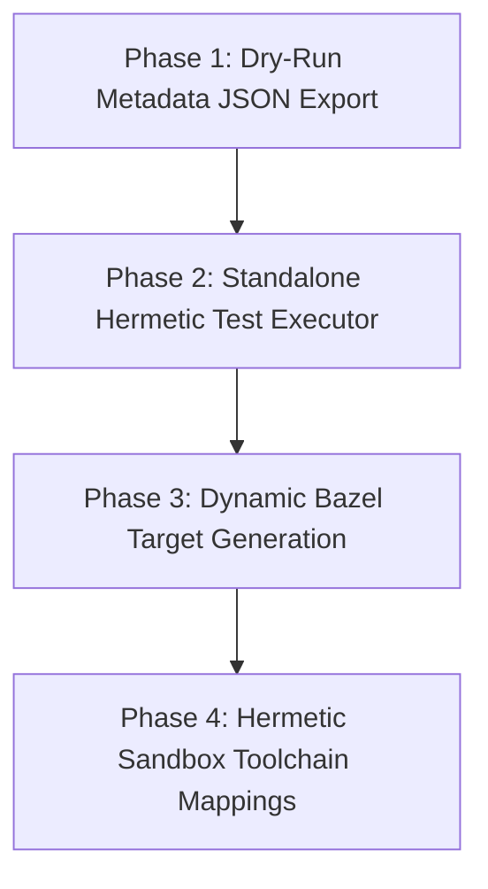

# Testing Migration Roadmap: Transitioning to Pure Bazel Testing

This document defines the design and roadmap for migrating the Dart SDK's testing infrastructure from the legacy `tools/test.py` and `pkg/test_runner` dynamic wrapper model to a native, hermetic, and parallelized Bazel testing system (`bazel test //...`).

---

## 1. Context & Background
The Dart SDK possesses an extensive, highly optimized test suite (tens of thousands of tests covering language specifications, core libraries, compiler backend features, and the co19 suites) managed by the `tools/test.py` launcher and the Dart-based test runner package under [pkg/test_runner](file:///usr/local/google/home/kevmoo/github/sdk/pkg/test_runner).

Today, the execution flow is highly coupled:
1. `tools/test.py` bootstraps a checked-in stable Dart VM and runs `test_runner.dart`.
2. [pkg/test_runner](file:///usr/local/google/home/kevmoo/github/sdk/pkg/test_runner) parses configurations, compiles necessary runtime targets using GN/Ninja dynamically on-the-fly, walks test folders, parses `.status` files to extract expectations, schedules parallel compile/run commands, and parses output logs.

---

## 2. The Architectural Collision
Transitioning to a **Pure Bazel Testing** world (`bazel test //...`) introduces a core conflict between the test runner's runtime model and Bazel's build graph constraints:

* **Dynamic Status Expectations vs. Static Outcomes**: `.status` files apply rules (e.g., `[ $compiler == dartk && $runtime == vm ]`, `test_name: Skip, Fail, Slow, Crash`) at execution time. If a compiler test fails as *expected* (`Fail`), the test execution exits with a non-zero code, but the Dart test runner reports it as a success. Bazel, however, expects a simple binary model: exit code `0` represents a test success, and any non-zero exit code is a test failure. If run directly under Bazel, all expected failures would flag as Bazel test failures.
* **Non-Hermetic Execution**: `pkg/test_runner` assumes a local, mutable checkout layout. It expects to read relative files from the repository root, traverse directories, and invoke local compiler binaries dynamically. Bazel sandboxing isolates execution, completely blocking un-declared filesystem access.

---

## 3. Unified Pure-Bazel Testing Proposal
To move to a pure Bazel testing model without losing the value of `.status` files or breaking the execution harness, we propose a **4-Phase Migration Roadmap**:



### Phase 1: Dry-Run Metadata JSON Export
We add a `--dump-test-metadata=<json-file>` option to [pkg/test_runner](file:///usr/local/google/home/kevmoo/github/sdk/pkg/test_runner). When run in this mode:
* The runner performs a target walk, parses `.status` files, resolves all test configurations, and extracts expected outcomes.
* Instead of executing commands, it dumps a structured JSON array of all resolved test targets:
  ```json
  [
    {
      "name": "language/class/cyclic_class_member_test",
      "file_path": "tests/language/class/cyclic_class_member_test.dart",
      "expected_outcome": "Fail",
      "commands": [
        {
          "executable": "bazel-bin/runtime/bin/dart",
          "arguments": ["--enable-asserts", "tests/language/class/cyclic_class_member_test.dart"]
        }
      ]
    }
  ]
  ```

### Phase 2: Standalone Hermetic Test Executor (`run_single_test.dart`)
We create a lightweight, zero-dependency Dart wrapper at [pkg/test_runner/bin/run_single_test.dart](file:///usr/local/google/home/kevmoo/github/sdk/pkg/test_runner/bin/run_single_test.dart):
* It accepts a single JSON-resolved test configuration definition.
* It invokes the compile and run commands under the sandbox.
* It matches the actual outcome with the `expected_outcome` (e.g., if a test fails and was expected to fail, it translates the result to a clean exit code `0`).
* This converts complex runtime expectations into Bazel-compliant binary exit codes.

### Phase 3: Dynamic Bazel Target Generation
We write a custom Bazel Starlark repository rule:
* The rule invokes Phase 1's dry-run metadata exporter at Bazel analysis time.
* It parses the generated JSON and dynamically outputs a `BUILD.bazel` file containing individual `dart_test` targets:
  ```bazel
  dart_test(
      name = "language_class_cyclic_class_member_test",
      srcs = ["tests/language/class/cyclic_class_member_test.dart"],
      data = ["//runtime/bin:dart"],
      args = ["--config-json", "$(location :test_config.json)"],
  )
  ```
* Bazel now natively schedules, sandboxes, parallelizes, and caches every single test case independently!

### Phase 4: Hermetic Sandbox Toolchain Mappings
* Declare external browser dependencies (Chrome, Firefox) and JS runtimes (`d8`, `jsshell`) as Bazel toolchains, passing resolved sandbox paths to the executor to fully eliminate host environment leakage.

---

## 4. Immediate Refactoring Tasks in `pkg/test_runner`
To prepare the current codebase for this transition, we should prioritize these non-destructive refactorings:

1. **Decouple GN/Ninja Build Triggers**: Add a `--no-build` flag to the runner options to completely skip target compiling inside `testConfigurations()` when running under Bazel.
2. **Isolate Status File Parser**: Promote [pkg/status_file](file:///usr/local/google/home/kevmoo/github/sdk/pkg/status_file) to a clean standalone library with zero `pkg/test_runner` dependency, making it consumable by external Starlark/JSON generators.
3. **Clean Directory-Traversal Assumptions**: Refactor path resolution in `test_suite.dart` to accept input root overrides rather than assuming absolute relative traversal from the standard `repo_dir`.
